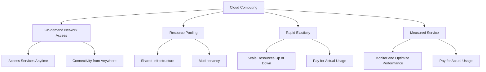

# 📄 Introduction to Cloud Computing 
---
## 📋 **Overview**
Welcome to the "Introduction to Cloud Computing" workshop! In this session, we will explore the world of cloud computing and its applications. Cloud computing has revolutionized the way businesses and individuals store, manage, and process data. This workshop aims to provide you with a solid foundation in cloud computing concepts, services, and benefits. 

## 🎯 **Objectives**
By the end of this workshop, you will:

- Understand the fundamental concepts of cloud computing. 
- Learn about different cloud service models and deployment models.
- Explore popular cloud service providers such as AWS, GCP and Azure. 
- Gain hands-on experience with cloud resources and services such as AWS Amplify and AWS S3 Buckets.
- Understand the benefits and challenges of cloud adoption. 

## 🔍 **Prerequisites**
To participate in this workshop, you should have a basic understanding of computer systems and networking. Familiarity with programming concepts and the command line interface will be beneficial. Please ensure you have the following requirements met:

- Laptop with internet connectivity. 
- Web browser (preferably Google Chrome or Mozilla Firefox).
- A valid email address to create accounts on cloud platforms. 
- Credit Card Details to signup for AWS.

## 🚀 **Workshop Outline**

*The workshop will consist of the following sections:*

1. Introduction to Cloud Computing
    - Overview of cloud computing and its importance: 
        - Cloud Computing is defined as the practice of using remote servers hosted on the internet to store, manage and process data rather than using a local. 
    - Benefits and challenges of adopting cloud services. 


2. Cloud Service Models
    - Infrastructure as a Service (IaaS)
    - Platform as a Service (PaaS)
    - Software as a Service (SaaS)

        | Category | Service Model | Examples |
        | --- | --- | --- |
        | IAAS | Infrastructure as a Service | Amazon EC2, Azure Blob Storage, Google Cloud VPC |
        | SAAS | Software as a Service | Gmail, Google Docs, Salesforce |
        | PAAS | Platform as a Service | Heroku, Azure App Service, AWS RDS |
    

3. Cloud Deployment Models
    - Public, private, hybrid, and multi-cloud environments. 
    - Considerations for choosing a deployment model. 

    | Cloud Deployment Models | Considerations |
    | --- | --- |
    | Public Cloud | Scalability, Cost, Convenience |
    | Private Cloud | Control, Security, Compliance |
    | Hybrid Cloud | Flexibility, Data Sovereignty, Cost |
    | Multi-cloud | Vendor Lock-In, Redundancy, Data Portability |


4. Popular Cloud Service Providers
    - Amazon Web Services (AWS)
    - Google Cloud Platform (GCP) 
    - Microsoft Azure 
    ```mermaid
    graph LR
    E[Cloud Service Providers] --> A[AWS]
    E --> B[GCP]
    E --> C[Azure]
    ```


5. Hands-on Cloud Experience
    - Account setup on AWS.  
    - Hosting a website or app using AWS on Free Tier can be done in two ways: 

    | Hosting an App or Website on AWS Free Tier |
    | AWS Amplify | A service which is dedicted to hosting website and application on AWS Cloud, similar to Vercel and other wesbite/app hosting services. |
    | AWS S3 Buckets |  |

    - AWS S3 Bucket Visual Representation   
        [AWS S3](https://a.l3n.co/i/OPqxzP.png)

    - AWS Amplify Visual Representation 
        [AWS Amplify](https://b.l3n.co/i/OPqaKo.png)

6. Real-World Cloud Applications
    - Case studies and examples of cloud adoption. 
    - Industry-specific use cases. 

    | Cloud Applications | Case Studies and Examples | Industry-Specific Use Cases |
    | --- | --- | --- |
    | Infrastructure as a Service (IAAS) |  Netflix: Migrated its video streaming platform to AWS, leveraging its scalability and global reach. |  E-commerce: Hosting websites and managing scalable infrastructure for online retail. |
    | Software as a Service (SAAS) |  Salesforce: Provides customer relationship management (CRM) software as a cloud-based service. |  Healthcare: Managing electronic health records and telehealth solutions. |
    | Platform as a Service (PAAS) |  Heroku: Offers a cloud application platform for developers to deploy and scale applications. |  Financial Services: Building and deploying fintech applications for banking and investment management. |
    | Cloud Storage and Backup |  Dropbox: Provides cloud storage and file synchronization services for individuals and businesses. |  Media and Entertainment: Storing and streaming large media files for content distribution. |
    | Big Data and Analytics |  Airbnb: Utilizes cloud-based data analytics to gain insights into user behavior and optimize pricing. |  Manufacturing: Analyzing sensor data for predictive maintenance and optimizing production processes. |
    | Internet of Things (IoT) |  Philips Hue: Cloud-based smart lighting system enabling remote control and automation. |  Smart Cities: Collecting and analyzing data from connected devices to improve urban infrastructure. |


7. Future Trends in Cloud Computing
    - Serverless computing
    - Edge computing
    - Artificial Intelligence (AI) and Machine Learning (ML) in the cloud 
    ```mermaid
    graph LR
    A[Future Trends] --> B[Serverless Computing]
    A --> C[Edge Computing]
    A --> D[AI and ML in the Cloud]

    B --> B1[Automatic Scaling]
    B --> B2[Cost Optimization]
    B --> B3[Event-driven Execution]

    C --> C1[Reduced Latency]
    C --> C2[Real-time Processing]
    C --> C3[Beneficial for IoT and Data-intensive Workloads]

    D --> D1[Scalable Infrastructure]
    D --> D2[Development, Training, and Deployment of AI/ML Models]
    D --> D3[Pre-built AI Services]
    ```


## 🌐 **Additional Resources**
To continue your learning journey beyond this workshop, here are some recommended resources:

1. Books:
    - "Cloud Computing: Concepts, Technology & Architecture" by Thomas Erl, Ricardo Puttini, and Zaigham Mahmood 📚
    - "Cloud Native: Using Containers, Functions, and Data to Build Next-Generation Applications" by Boris Scholl, Trent Swanson, and Peter Jausovec 📚

2. Online Courses:
    - Coursera: "Cloud Computing Basics" by University of Illinois at Urbana-Champaign 🖥️
    - FreeCodeCamp : "AWS Certified Cloud Practitioner Training 2020" by Andrew Brown 🎓
    
---

 *To make such stunning visual documentation you can refer to the [MarkDown Tutorial](https://ahmedthahir.github.io/gdscbpdc/2022-2023/02_Markdown/) by GDSC!*