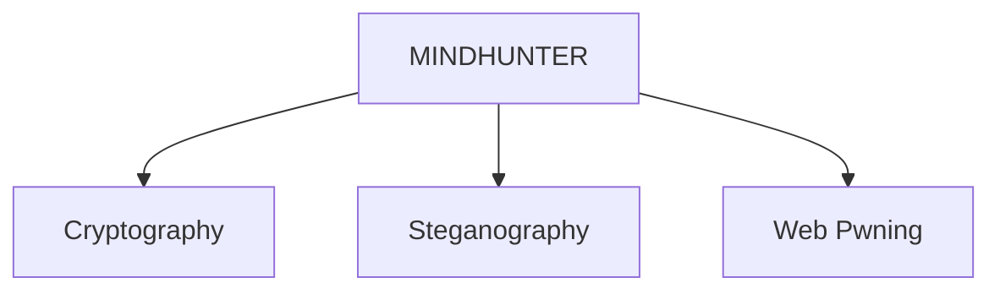

# Event Recap: 

## 1. Capture the Flag - Mindhunter [October 20, 2022]

On October 20, 2022, the Google Developer Student Club (GDSC) orchestrated **MINDHUNTER**, a diverse challenge blending [cryptography](https://en.wikipedia.org/wiki/Cryptography), [steganography](https://en.wikipedia.org/wiki/Steganography), [web pwning](https://delinea.com/what-is/pwn#:~:text=PWN%20is%20hacker%20jargon%20meaning,a%20misspelling%20of%20“owned.”), and more. Participants delved into intricate questions on a custom web server, revealing elusive **Flags** to amass points. With approximately 50 on-site and a multitude of online attendees, the event's triumph was evident in participants' unwavering enthusiasm and dedication. **MINDHUNTER** effectively imparted education, inspiration, and dynamic problem-solving engagement.

## 2. Prompt Engineering [April 29th, 2023]

 Participants actively engaged by submitting prompts into [ChatGPT](https://chat.openai.com) and receiving working code as output to solve the given problem. The submission process was facilitated through the [Hackerrank Server](https://www.hackerrank.com), allowing participants to make multiple submissions. Evaluation of participants' performance was based on the speed and accuracy of their code.

***Winning prizes included, GDSC Shirts and Stickers!***

## 3. GDSC x IEI Coding Warfare: Technofest [May 3rd, 2023]

A captivating showcase of coding prowess unfolded at GDSC x IEI Coding Warfare during Technofest 2023 at BITS Pilani Dubai Campus. On May 3rd, the solo round tested participants with competitive programming questions, evaluating their coding abilities, problem-solving skills, and speed. The event was conducted on the [Hackerrank](https://www.hackerrank.com) platform, ensuring an equitable and standardized environment for all participants.

 ***Winning prizes included 100 AED, GDSC Shirts and Stickers!***