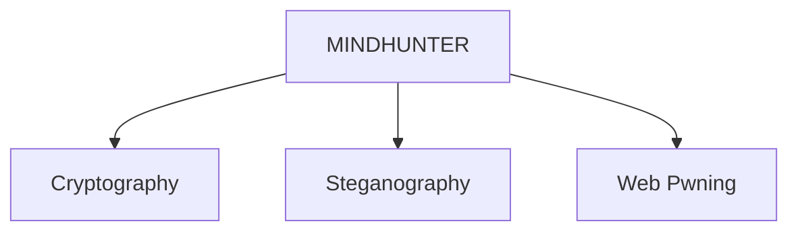

# Event Recap: 

## 1. Capture the Flag - Mindhunter [October 20, 2022]

On October 20, 2022, the Google Developer Student Club (GDSC) organized **MINDHUNTER**, an engaging challenge that seamlessly combined elements of [cryptography](https://en.wikipedia.org/wiki/Cryptography), [steganography](https://en.wikipedia.org/wiki/Steganography), [web pwning](https://delinea.com/what-is/pwn#:~:text=PWN%20is%20hacker%20jargon%20meaning,a%20misspelling%20of%20“owned.”), and more. Participants were immersed in solving intricate questions presented by a custom web server, each solution revealing elusive **Flags** which contributed to their point accumulation. What set this event apart was its time-based nature, where participants raced against the clock to maximize their scores.

The success of **MINDHUNTER** was evident by the enthusiastic participation of approximately 50 attendees on-site, as well as a multitude of online participants. The event not only fostered an atmosphere of dynamic problem-solving engagement but also provided a platform for participants to showcase their skills in cryptography, steganography, and web security.

The judging criteria for the event was based on the participants' ability to score the maximum number of points within the given time frame. This approach added an extra layer of competition and urgency to the challenge, further enhancing the excitement and dedication of the participants. Overall, **MINDHUNTER** effectively delivered education, inspiration, and an opportunity for participants to showcase their prowess in tackling complex problems within a time-sensitive environment.

## 2. Prompt Engineering [April 29th, 2023]

 Participants actively engaged by submitting prompts into [ChatGPT](https://chat.openai.com) and receiving working code as output to solve the given problem. The submission process was facilitated through the [Hackerrank Server](https://www.hackerrank.com), allowing participants to make multiple submissions. Evaluation of participants' performance was based on the speed and accuracy of their code. A helpful doubt-clearing session followed, giving participants the chance to resolve uncertainties. This emphasized holistic learning, refining problem-solving and deepening understanding.

***Winning prizes included, GDSC Shirts and Stickers!***

## 3. GDSC x IEI Coding Warfare: Technofest [May 3rd, 2023]

A captivating showcase of coding prowess unfolded at GDSC x IEI Coding Warfare during Technofest 2023 at BITS Pilani Dubai Campus. On May 3rd, the solo round tested participants with competitive programming questions, evaluating their coding abilities, problem-solving skills, and speed. The event was conducted on the [Hackerrank](https://www.hackerrank.com) platform, ensuring an equitable and standardized environment for all participants.

 ***Winning prizes included 100 AED, GDSC Shirts and Stickers!***
